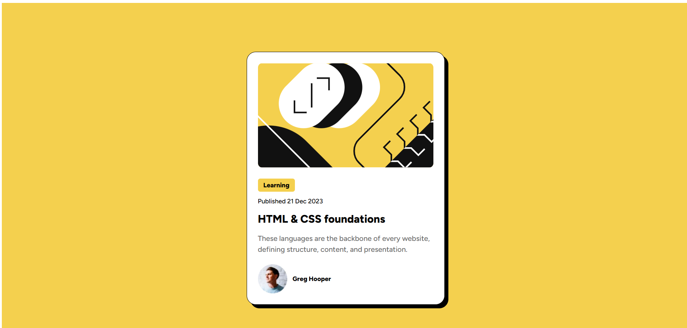

# Frontend Mentor - Blog preview card solution

This is a solution to the [Blog preview card challenge on Frontend Mentor](https://www.frontendmentor.io/challenges/blog-preview-card-ckPaj01IcS). Frontend Mentor challenges help you improve your coding skills by building realistic projects.

## Table of contents

- [Overview](#overview)
  - [The challenge](#the-challenge)
  - [Screenshot](#screenshot)
  - [Links](#links)
- [My process](#my-process)
  - [Built with](#built-with)
  - [What I learned](#what-i-learned)
  - [Continued development](#continued-development)
  - [Useful resources](#useful-resources)
- [Author](#author)

## Overview

### The challenge

Users should be able to:

- See hover and focus states for all interactive elements on the page

### Screenshot

### Links

- Solution URL: [https://github.com/WengelleY/blog-preview-card]
- Live Site URL: [https://wengelley.github.io/blog-preview-card/]

### Built with

- HTML5
- CSS3 (mobile-first)
- Flexbox
- Google Fonts (Figtree)

### What I learned

- Practiced a mobile-first workflow and responsive layout using Flexbox.
- Implemented hover and focus states for better accessibility and visual feedback.
- Learned to include and serve optimized image assets (webp / svg) for a smaller bundle size.
- Used Google Fonts (Figtree) and ensured it loads correctly with preconnect.

**Note: Delete this note and the content within this section and replace with your own learnings.**

### Continued development

- Explore CSS Grid for more advanced layout patterns.
- Add JavaScript enhancements like animations or theme switching.
- Continue improving accessibility and keyboard navigation support.

### Useful resources

- [Video Tutorial 1](https://youtu.be/zI6DW1Sinqc?si=ZIbqwSA45qDl_1_M) - Helped me understand layout and card styling.
- [Video Tutorial 2](https://youtu.be/phWxA89Dy94?si=q2Nx-TILA-eQyCkm) - Showed how to make responsive hover effects.

## Author

- Website - [wengelle yohannes](https://github.com/WengelleY)
- Frontend Mentor - [@WengelleY]https://www.frontendmentor.io/profile/WengelleY
